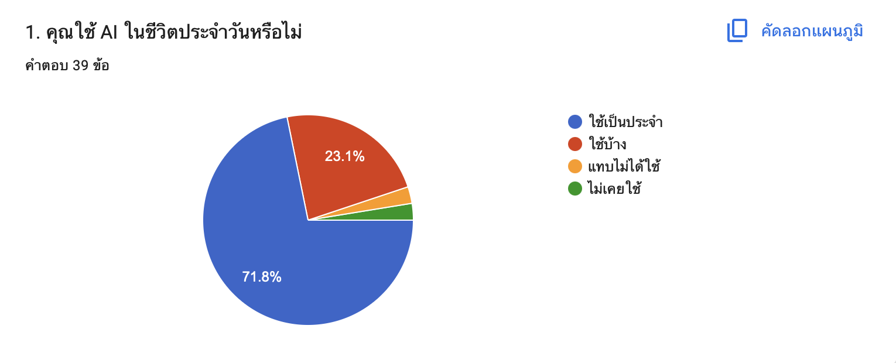

Data Storytelling: ผลการสำรวจ AI กับชีวิตประจำวันของนักศึกษามหาวิทยาลัย

1. ที่มาและวัตถุประสงค์

โครงการนี้จัดทำขึ้นเพื่อศึกษาข้อมูลเกี่ยวกับ AI กับชีวิตประจำวันของนักศึกษามหาวิทยาลัย
โดยมีวัตถุประสงค์เพื่อวิเคราะห์ความคิดเห็นและพฤติกรรม
ของกลุ่มตัวอย่าง และค้นหาประเด็นที่น่าสนใจจากผลการสำรวจ

วัตถุประสงค์ของการศึกษา ได้แก่

- ศึกษาข้อมูลพื้นฐานของผู้ตอบแบบสำรวจ
- วิเคราะห์ผลการสำรวจ
- ค้นหาแนวโน้มและประเด็นที่น่าสนใจ
- นำเสนอข้อมูลผ่านกราฟและ Data Storytelling

2. วิธีการเก็บข้อมูล

ข้อมูลที่ใช้ในการศึกษาครั้งนี้รวบรวมจากแบบสอบถาม
โดยมีกลุ่มตัวอย่างจำนวน 39 คน

ข้อมูลถูกนำมาตรวจสอบและจัดเตรียมก่อนนำไปวิเคราะห์
เพื่อให้สามารถนำเสนอผลลัพธ์ได้อย่างถูกต้องและเข้าใจง่าย

3. การวิเคราะห์ข้อมูล

3.1 ข้อมูลทั่วไปของผู้ตอบแบบสำรวจ

จากการวิเคราะห์ข้อมูลพบว่า มีจำนวนนักศึกษาที่ใช้ AI เป็นประจำมากถึง 71.8% ของผู้ตอบแบบสำรวจทั้งหมด

### 3.2 ผลการสำรวจ

เมื่อพิจารณาผลการสำรวจในประเด็น...

### 3.3 การเปรียบเทียบข้อมูล

เมื่อนำข้อมูลของแต่ละกลุ่มมาเปรียบเทียบกัน พบว่า...

---

## 4. การตีความผลลัพธ์

จากผลการวิเคราะห์พบประเด็นสำคัญดังนี้

### Insight 1

...

### Insight 2

...

### Insight 3

...

---

## 5. สรุปผล

จากการวิเคราะห์ข้อมูลพบว่า...

ผลการศึกษาช่วยให้เห็นแนวโน้มและลักษณะสำคัญ
ของข้อมูลได้ชัดเจนมากขึ้น

---

## 6. ข้อเสนอแนะ

จากผลการสำรวจ สามารถเสนอแนวทางได้ดังนี้

1. ...
2. ...
3. ...

สำหรับการเก็บข้อมูลในอนาคต ควรเพิ่มจำนวนกลุ่มตัวอย่าง
และครอบคลุมกลุ่มผู้ตอบที่หลากหลายมากขึ้น
