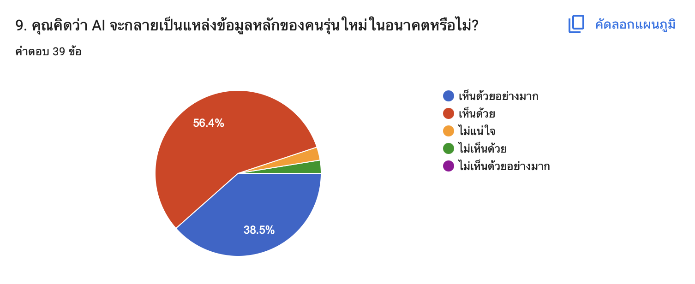

Data Storytelling: ผลการสำรวจ AI กับชีวิตประจำวันของนักศึกษามหาวิทยาลัย

## 1. ที่มาและวัตถุประสงค์

โครงการนี้จัดทำขึ้นเพื่อศึกษาข้อมูลเกี่ยวกับ AI กับชีวิตประจำวันของนักศึกษามหาวิทยาลัย
โดยมีวัตถุประสงค์เพื่อวิเคราะห์ความคิดเห็นและพฤติกรรม
ของกลุ่มตัวอย่าง และค้นหาประเด็นที่น่าสนใจจากผลการสำรวจ

วัตถุประสงค์ของการศึกษา ได้แก่

- ศึกษาข้อมูลพื้นฐานของผู้ตอบแบบสอบถาม
- วิเคราะห์ผลการสำรวจ
- ค้นหาแนวโน้มและประเด็นที่น่าสนใจ
- นำเสนอข้อมูลผ่านกราฟและ Data Storytelling

## 2. วิธีการเก็บข้อมูล

ข้อมูลที่ใช้ในการศึกษาครั้งนี้รวบรวมจากแบบสอบถาม
โดยมีกลุ่มตัวอย่างจำนวน 39 คน

ข้อมูลถูกนำมาตรวจสอบและจัดเตรียมก่อนนำไปวิเคราะห์
เพื่อให้สามารถนำเสนอผลลัพธ์ได้อย่างถูกต้องและเข้าใจง่าย

## 3. การวิเคราะห์ข้อมูล

### 3.1 ข้อมูลทั่วไปของผู้ตอบแบบสอบถาม

จากการวิเคราะห์ข้อมูลพบว่า มีจำนวนนักศึกษาที่ใช้ AI เป็นประจำมากถึง 71.8% ของผู้ตอบแบบสำรวจทั้งหมด

### 3.2 ผลการสำรวจ

เมื่อพิจารณาผลการสำรวจในประเด็นที่ AI จะเป็นอย่างไรในอนาคต พบว่านักศึกษาส่วนใหญ่เห็นด้วยกับการที่ AI จะเป็นแหล่งข้อมูลหลักของคนรุ่นใหม่ในอนาคต แสดงให้เห็นว่า AI มีอิทธิพลต่อชีวิตประจำวันของเหล่านักศึกษาแค่ไหน

---

## 4. การตีความผลลัพธ์

จากผลการวิเคราะห์พบประเด็นสำคัญดังนี้

### Insight 1

AI กำลังกลายเป็นแหล่งข้อมูลสำคัญในอนาคต
ผลการสำรวจพบว่า นักศึกษาส่วนใหญ่เห็นด้วยกับแนวคิดที่ว่า AI จะกลายเป็นแหล่งข้อมูลหลักในอนาคต สะท้อนให้เห็นว่า AI ไม่ได้ถูกมองเพียงเป็นเครื่องมือช่วยค้นหาข้อมูลหรือช่วยทำงานเท่านั้น แต่มีแนวโน้มที่จะเข้ามามีบทบาทมากขึ้นในการเข้าถึงและคัดกรองข้อมูลในชีวิตประจำวันของนักศึกษา
ผลลัพธ์ดังกล่าวแสดงให้เห็นถึงการยอมรับเทคโนโลยี AI ในกลุ่มนักศึกษา และสะท้อนว่าการใช้ AI อาจกลายเป็นส่วนหนึ่งของกระบวนการเรียนรู้และการค้นหาข้อมูลในอนาคต

### Insight 2

นักศึกษาเริ่มมอง AI เป็น “ผู้ช่วย” มากกว่าแค่เครื่องมือ
จากพฤติกรรมการใช้งาน AI ของผู้ตอบแบบสำรวจ พบว่า AI เข้ามามีบทบาทในกิจกรรมต่าง ๆ ของนักศึกษา ไม่ว่าจะเป็นการค้นหาข้อมูล การเรียน หรือการช่วยแก้ปัญหา ซึ่งสะท้อนการเปลี่ยนแปลงจากการใช้ AI เป็นเพียงเทคโนโลยีใหม่ ไปสู่การมอง AI ในฐานะ ผู้ช่วยในชีวิตประจำวัน

### Insight 3

การยอมรับ AI มาพร้อมกับความจำเป็นในการตรวจสอบข้อมูล
แม้ว่านักศึกษาส่วนใหญ่จะเห็นด้วยกับการที่ AI จะเป็นแหล่งข้อมูลหลักในอนาคต แต่การพึ่งพา AI มากขึ้นทำให้ ทักษะการตรวจสอบและประเมินความน่าเชื่อถือของข้อมูลมีความสำคัญมากขึ้นเช่นกัน เนื่องจากข้อมูลที่ได้รับจาก AI ควรถูกพิจารณาและตรวจสอบกับแหล่งข้อมูลที่น่าเชื่อถือก่อนนำไปใช้งาน

---

## 5. สรุปผลและข้อเสนอแนะ

จากการวิเคราะห์ข้อมูล "AI กับชีวิตประจำวันของนักศึกษามหาวิทยาลัย” พบว่า AI เข้ามามีบทบาทในชีวิตประจำวันของนักศึกษามากขึ้น ทั้งในด้านการค้นหาข้อมูล การเรียนรู้ และการช่วยอำนวยความสะดวกในการทำงานต่าง ๆ โดยประเด็นที่น่าสนใจคือ นักศึกษาส่วนใหญ่เห็นด้วยว่า AI จะกลายเป็นแหล่งข้อมูลหลักในอนาคต สะท้อนให้เห็นถึงการยอมรับและความสำคัญของ AI ที่เพิ่มขึ้นในด้านการเข้าถึงข้อมูลและการเรียนรู้ อย่างไรก็ตาม แม้ AI จะสามารถช่วยให้การค้นหาและทำความเข้าใจข้อมูลสะดวกและรวดเร็วขึ้น แต่ผู้ใช้งานควรตรวจสอบความถูกต้องของข้อมูลจากแหล่งที่น่าเชื่อถือก่อนนำไปใช้งาน รวมถึงควรใช้วิจารณญาณและทักษะการคิดวิเคราะห์ควบคู่ไปกับการใช้ AI ดังนั้น นักศึกษาควรมอง AI เป็น เครื่องมือช่วยในการเรียนรู้และการทำงาน มากกว่าการพึ่งพา AI เพียงอย่างเดียว เพื่อให้สามารถใช้ประโยชน์จากเทคโนโลยีได้อย่างเหมาะสม มีความรับผิดชอบ และเกิดประโยชน์สูงสุดในชีวิตประจำวันและการศึกษา
